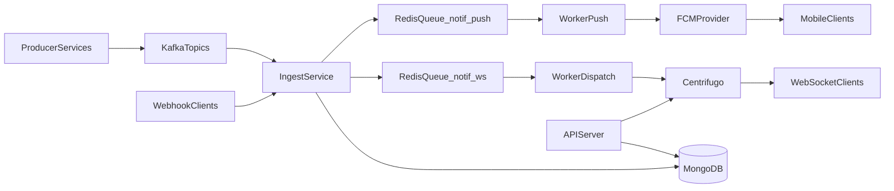
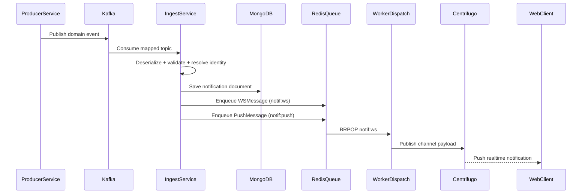
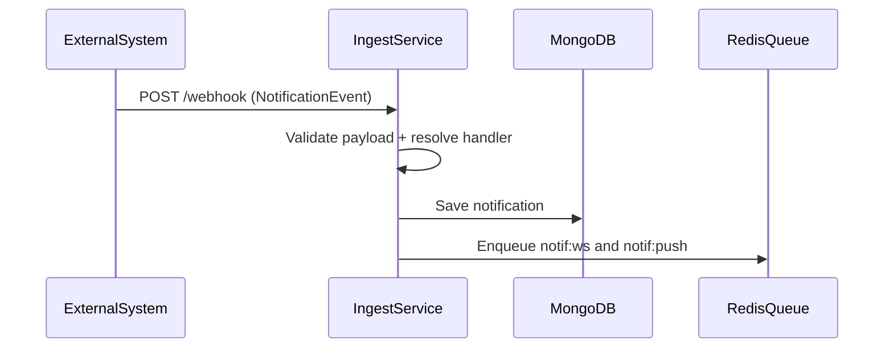
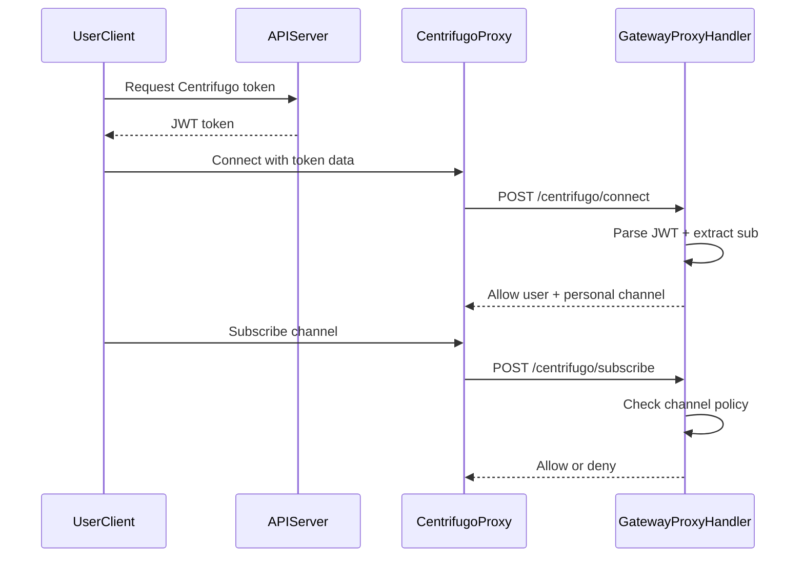

# Notification Service Core Flow

This document explains the core architecture and runtime sequences for the notification service in production-like setup (Golang services, Kafka, Redis, MongoDB, Centrifugo, and FCM-ready push worker).

## 1) Core Components

- `api`: REST APIs for notifications, preferences, subscribers, and Centrifugo token.
- `ingest`: event ingestion from Kafka and `/webhook`.
- `worker-dispatch`: consumes websocket jobs from Redis and publishes to Centrifugo.
- `worker-push`: consumes push jobs from Redis (currently stub behavior for push delivery).
- `mongodb`: notification, preference, and subscriber persistence.
- `redis`: queue transport between ingest and workers.
- `kafka`: source event bus for notification triggers.
- `centrifugo`: realtime websocket fanout to clients.

## 2) High-Level Architecture

## 3) Sequence: Event -> Persist -> Dispatch

## 4) Sequence: Webhook Path (No Kafka)

## 5) Sequence: Realtime Websocket Auth and Subscribe

## 6) Message Contracts (Practical View)

- Incoming event contract: `NotificationEvent` (identity + actor + object + payload + targets).
- Queue contracts:
  - `WSMessage`: room/channel target and payload for realtime publish.
  - `PushMessage`: title/body/data for push pipeline.
- Topic mapping controls which domain topic maps to which notification identity.

## 7) Runtime Ports and Health Endpoints

- `api`: serves API and `/healthz`, `/readyz`.
- `ingest`: serves `/webhook`, `/healthz`, `/readyz`.
- `worker-dispatch`: health server on `:9090`.
- `worker-push`: health server on `:9091`.

## 8) Operational Notes

- `worker-push` currently logs push payload and is designed for future FCM/Web Push delivery integration.
- `worker-dispatch` publishes into Centrifugo channels derived from room/user identifiers.
- Ingest can run with Kafka consumer and webhook fallback in parallel.
- Redis queues decouple ingestion from downstream realtime/push fanout.

## 9) Deployment-Oriented Checklist

- Ensure topic-to-identity mapping is aligned with producer services.
- Ensure queue keys are consistent between ingest and workers.
- Ensure Centrifugo API URL/API key and proxy callback URLs are correct.
- Ensure Mongo indexes are created at startup for notification queries.
- Ensure readiness probes cover actual dependencies per service.

