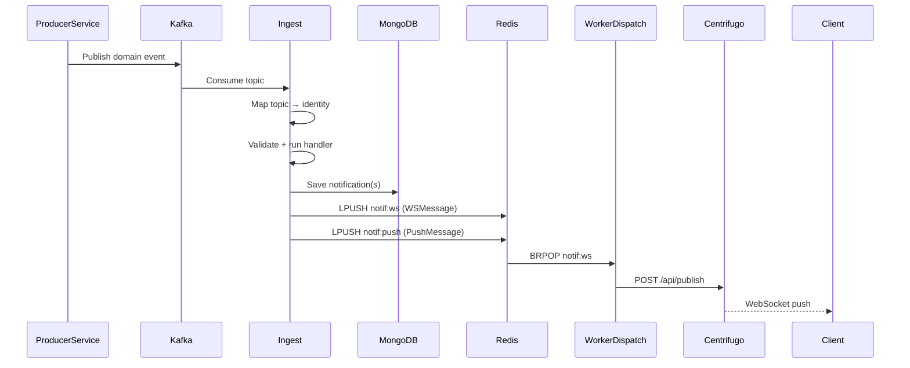
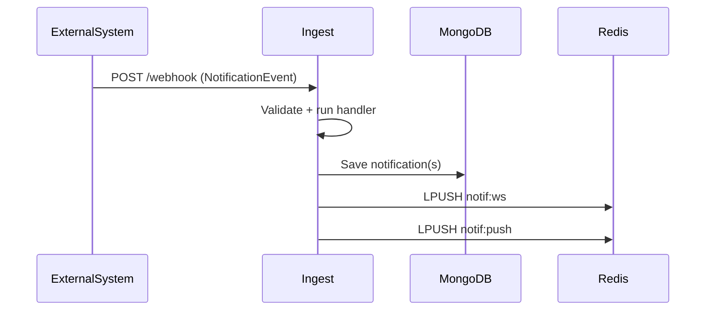

# Notification Flow

End-to-end walkthrough from event source to client delivery.

## Full Pipeline

```
Event Source (Kafka / Webhook)
         │
         ▼
  Handler Registry
  ┌──────────────────────────────────────┐
  │  identity → handler function         │
  │  content_published → ContentPublished│
  │  comment_created   → CommentCreated  │
  └────────────────┬─────────────────────┘
                   │  builds NotifyParams
                   ▼
  NotificationService.Process()
  ┌────────────────────────────────────────────────────────┐
  │  1. persistNotifications()  → MongoDB                  │
  │  2. IdentityChannels[identity] → [in_app, push]        │
  │  3. filterByPreference()    → remove opted-out users   │
  │  4. enrich()                → resolve device tokens    │
  │  5. dispatch per channel:                              │
  │     InAppDispatcher  → Redis notif:ws                  │
  │     PushDispatcher   → Redis notif:push                │
  └────────────────────────────────────────────────────────┘
         │                        │
  notif:ws                  notif:push
         │                        │
         ▼                        ▼
  WorkerDispatch           WorkerPush
  → Centrifugo             → FCM / Web Push
  → WebSocket client       → Mobile / Browser push
```

## Step 1 — Event Ingestion

### Via Kafka

`cmd/ingest` polls Kafka topics. On each message:

1. Deserialize message value as `contract.NotificationEvent`
2. Override `Identity` from `TopicToIdentity` map (source of truth):
   ```
   "modami.auth.user.activated" → "content_published"
   ```
3. Call `evt.Validate()` — checks identity is known and payload has actor + do
4. Look up handler in registry: `reg.Get(evt.Identity)`
5. Call handler

### Via HTTP Webhook

`POST /webhook` on ingest service. Accepts the same `NotificationEvent` JSON. Validates and dispatches identically to Kafka path. Used for direct integration without Kafka.

```bash
curl -X POST http://localhost:7074/webhook \
  -H "Content-Type: application/json" \
  -d '{
    "identity": "content_published",
    "payload": {
      "actor": { "id": "user-1", "type": "user" },
      "do": [{ "id": "post-1", "type": "post",
               "data": { "title": "My Post", "body": "Hello" } }]
    },
    "extra": { "to": ["user-2", "user-3"] }
  }'
```

## Step 2 — Handler Execution

Each handler extracts structured data from the raw event and builds `service.NotifyParams`:

```go
type NotifyParams struct {
    Identity   string
    Recipients []string          // user IDs to notify
    Title      string
    Body       string
    Link       string
    Extra      map[string]any    // stored with notification
}
```

### ContentPublished handler

| Source | Field |
|--------|-------|
| `payload.do[0].data["title"]` | Title |
| `payload.do[0].data["body"]` | Body |
| `extra.to` or `payload.do[0].data["audience_ids"]` | Recipients |
| `payload.actor.id` | actor_id in Extra |
| `payload.do[0].id` | content_id in Extra |
| `payload.do[0].type` | content_type in Extra |

### CommentCreated handler

| Source | Field |
|--------|-------|
| `"New comment on your post"` | Title (fixed) |
| `payload.do[0].data["content"]` | Body |
| `extra.to` | Recipients |
| `/posts/{io[0].id}#comment-{do[0].id}` | Link |

## Step 3 — NotificationService.Process()

### 3a. Persist

For each recipient, create a `domain.Notification`:

```go
type Notification struct {
    ID        string
    UserID    string
    EventType string            // identity
    Title     string
    Body      string
    Link      string
    Read      bool              // false on create
    Extra     map[string]any    // handler-specific metadata
    CreatedAt time.Time
}
```

Saved to MongoDB collection `notifications`. MongoDB indexes ensure efficient queries:
- `(user_id, created_at DESC)` — list notifications
- `(user_id, read, created_at DESC)` — filter unread

### 3b. Channel Resolution

`IdentityChannels` maps identity → delivery channels:

```go
var IdentityChannels = map[string][]string{
    ContentPublished: {ChannelInApp, ChannelPush},
    CommentCreated:   {ChannelInApp, ChannelPush},
}
```

### 3c. Preference Filtering

For each channel, `filterByPreference()` queries MongoDB `preferences` collection:

```go
type Preference struct {
    UserID       string
    InAppEnabled bool   // default: true
    PushEnabled  bool   // default: true
}
```

Users with the channel disabled are removed from the recipient list for that channel. If a user has no preference document, defaults to enabled.

### 3d. Enrich

For `push` channel only: `enrich()` queries MongoDB `subscribers` collection to resolve device tokens for each user:

```go
type Subscriber struct {
    ID              string
    UserID          string
    DeviceToken     string             // FCM token
    Platform        string             // ios, android, web
    WebPushEndpoint string
    WebPushKeys     map[string]string  // p256dh, auth
}
```

### 3e. Dispatch

| Channel | Dispatcher | Queue Key | Message Type |
|---------|-----------|-----------|-------------|
| `in_app` | `InAppDispatcher` | `notif:ws` | `WSMessage` |
| `push` | `PushDispatcher` | `notif:push` | `PushMessage` |

**WSMessage** (for `notif:ws`):
```json
{
  "room_id": "user:abc123",
  "event":   "content_published",
  "payload": { "notification_id": "...", "title": "...", "body": "...", "link": "..." }
}
```

**PushMessage** (for `notif:push`):
```json
{
  "device_tokens": ["fcm-token-1", "fcm-token-2"],
  "title": "My Post",
  "body":  "Hello",
  "link":  "https://..."
}
```

## Step 4 — Worker Dispatch (WebSocket delivery)

`cmd/worker-dispatch` runs `queue.Consume()` — a blocking `BRPOP` loop on `notif:ws`.

For each `WSMessage`:
1. Derive channel name: `ChannelFromRoomID("user:abc123")` → `"notifications:user:abc123"`
2. Call Centrifugo HTTP API: `POST /api/publish`
   ```json
   { "channel": "notifications:user:abc123", "data": { "event": "...", "payload": {...} } }
   ```
3. Centrifugo pushes the message to all WebSocket connections subscribed to that channel.

## Step 5 — Worker Push (Mobile/Browser push)

`cmd/worker-push` runs `queue.Consume()` on `notif:push`.

For each `PushMessage`:
- Reads device tokens and notification payload
- **Currently**: logs payload (stub)
- **Intended**: send via FCM (`firebase-admin-go`) or Web Push (VAPID)

## Sequence Diagrams

### Kafka Path



### Webhook Path



## Error Handling

| Stage | Behavior |
|-------|---------|
| Kafka deserialization error | Log + skip (no retry) |
| Event validation failure | Log + skip |
| Unknown identity | Accept + return 202 (no handler) |
| Handler error | Return error to Kafka consumer (triggers retry up to 3×, then DLQ) |
| MongoDB persist error | Log + continue dispatch |
| Redis enqueue error | Return error to caller |
| Centrifugo publish error | Log (worker continues) |
