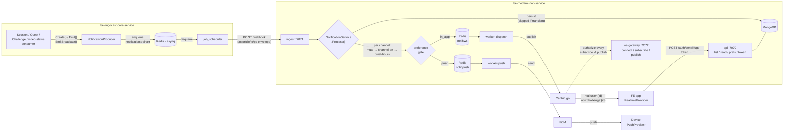
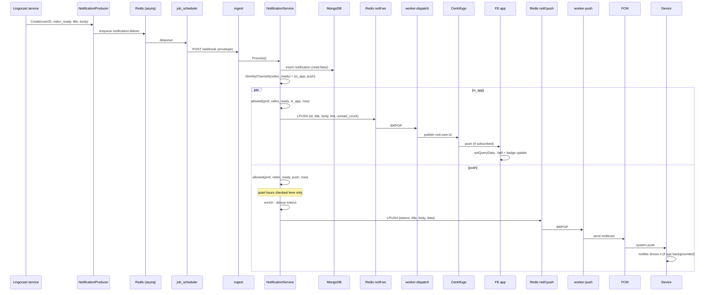
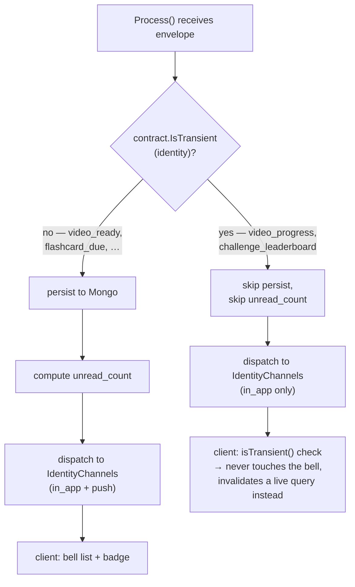
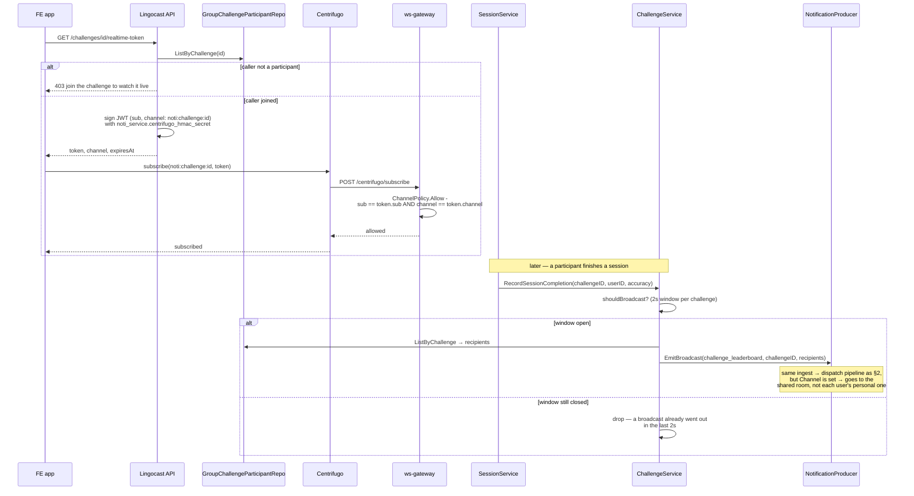
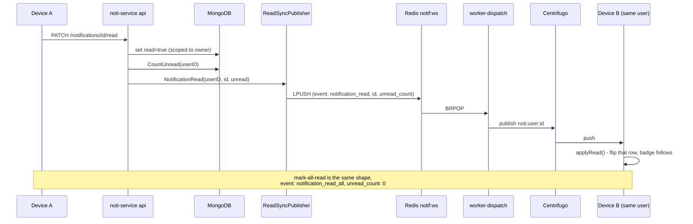
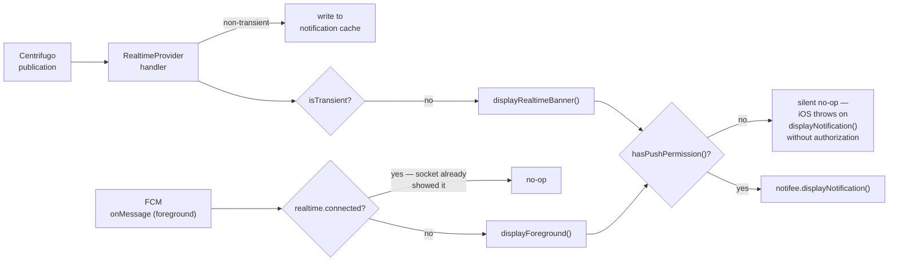
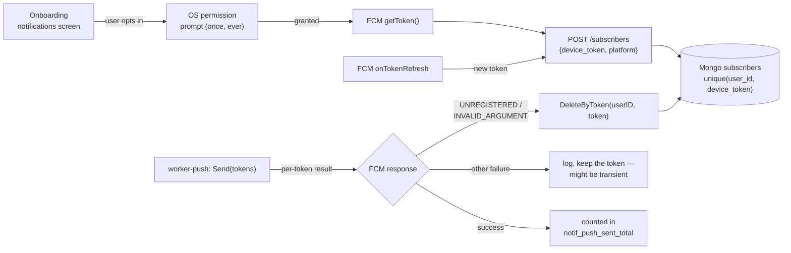
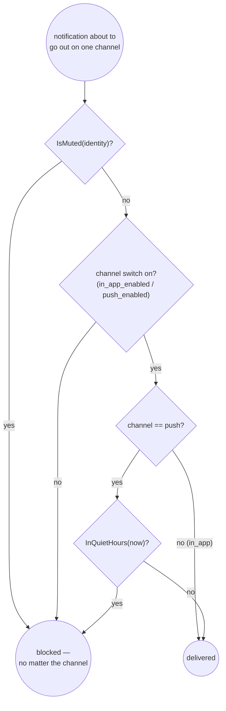

<title>Notification Flows</title>

# Notification & Realtime Flows

Reference for every path a notification or realtime event takes across the three
repos: `be-lingocast-core-service` (producer), `be-modami-noti-service`
(pipeline + delivery), `fe-lingocast-mobile-service` (client). Pairs with
[`CONTRACT.md`](./CONTRACT.md) (envelope shape, identity→channel table) and
[`observability.md`](./observability.md) (what to alert on when a flow breaks).

Status markers used below:

- ✅ **live-verified** — traced end to end on a running local stack (2026-09-17)
- 🔧 **code-complete, not yet live-tested** — implemented, unit-tested, never run against real infra

---

## 1. Who owns what



The one thing worth remembering from this picture: **lingocast never talks to
Centrifugo, Mongo, or FCM directly.** It only ever does two things — POST an
envelope to `ingest`, or answer a `/challenges/{id}/realtime-token` request
using a secret it shares with noti-service. Everything downstream of `ingest`
is noti-service's problem, which is the whole point of the split.

---

## 2. Standard notification — persisted, dual-channel ✅

The path for anything a user should be able to open later: `video_ready`,
`flashcard_due`, `achievement_unlocked`, `challenge_ended`. Traced live today
with a `video_ready` envelope; see the walkthrough below the diagram.



**Verified today:** the `in_app` half, exactly as drawn — webhook → Mongo
insert → `notif:ws` → `worker-dispatch` → Centrifugo → a subscribed WebSocket
client received `{event_type, title, body, link, id, created_at,
unread_count}` in real time, and `GET /notifications` showed the same row.
Ran it twice with two different identities (`video_ready`, then
`flashcard_due`) to confirm `unread_count` tracks the real total rather than
being hardcoded per event — second run correctly showed `1`, not `2`, because
the first notification had already been read by then.

**Verified 2026-09-18:** `worker-push` now has real FCM service-account
credentials (`config/firebase-credentials.json`, gitignored) and confirmed
auth against Firebase's API directly — a probe send to a bogus token came
back `Unregistered`, not an auth error, which only happens once Firebase has
actually authenticated the request. `SendEachForMulticast` batches ≤500
tokens per call; the client-side leg of this diagram (`FCM → Dev →
notifee`) still cannot be exercised end-to-end on the iOS Simulator —
`RNFBMessaging` explicitly skips `registerForRemoteNotifications` on ARM64
Simulator, so no real device token is ever minted there. Needs a physical
device to confirm the last hop.

---

## 3. Transient events skip half the pipeline ✅

`video_progress` and `challenge_leaderboard` take the *same* webhook →
`NotificationService.Process()` entry point as §2, but one check changes
everything downstream:



**Why this exists:** a single video import fires roughly six `video_progress`
events. Persisting them would leave six unread rows in the bell for one
import; pushing them would ring the phone on every pipeline tick. The
transient set is declared once, in `contract.TransientIdentities`
(noti-service) and mirrored in `lib/notification-events.ts` (FE) — both sides
are covered by a test that keeps them in sync.

**Verified today, both halves:** fired a `video_progress` envelope — the row
count from `GET /notifications` stayed at 2 (no insert), then fired a second
one with a listener attached and watched it arrive live with a bare payload
(`event_type`, `status`, `step`, `videoId` — no `id`, no `created_at`, no
`unread_count`), confirming the dispatcher genuinely skips enrichment for
transient identities rather than just omitting the Mongo write.

---

## 4. Challenge live leaderboard — membership-gated broadcast

**Channel security: ✅ live-verified. Lingocast's HTTP surface: 🔧 blocked locally.**

The one flow that isn't per-user. noti-service can't decide who may watch a
challenge — it doesn't know what a challenge is — so Lingocast decides and
vouches for it with a signed token.



The broadcast payload carries only the challenge id — clients refetch the
standings themselves, so the event never has to mirror the leaderboard's
shape. The 2-second window is per-process (`sync.Map`, not Redis); noted with
a `ponytail:` comment naming the upgrade path if two API pods ever make that
visible.

**Why the split status.** Lingocast's own auth is wired to a real
`user-service` over gRPC locally (`localhost:50050` is live), so a crafted
unverified JWT — which works fine for testing noti-service directly — gets
rejected: the auth middleware calls `GetUserBasic("test-user-1")` and gets
`NotFound`. Exercising `GET /challenges/{id}/realtime-token` for real needs a
genuine logged-in account, which this session doesn't have.

What *was* tested, by minting subscription tokens directly with the same
`local-dev-token-secret` Lingocast signs with (bypassing the HTTP layer, not
the cryptography) — the actual security-critical mechanism, live against a
running Centrifugo:

| Token | Result |
|---|---|
| `sub` matches connected user, `channel` matches subscribed channel | ✅ subscribed |
| `sub` = a different user | ❌ disconnected — `"token user mismatch"` |
| `channel` = a different challenge | ❌ disconnected — `"token channel mismatch"` |
| signed with the wrong secret entirely | ❌ `code 103 "permission denied"` — falls through to `ChannelPolicy.Allow`, which independently rejects it |

The last row is worth noting: Centrifugo verifies `sub`/`channel` tokens
natively when the signature checks out (rows 1–3 never reach `ws-gateway` at
all), but a token that fails *Centrifugo's own* verification falls through to
the subscribe-proxy anyway — where `ChannelPolicy.Allow` rejects it a second,
independent way. Two layers, not one with a silent bypass.

Then subscribed with the valid token and fired a real `challenge_leaderboard`
broadcast at the webhook — it arrived on `noti:challenge:chl-demo-1` with
exactly the bare shape the design calls for: `event_type`, `challengeId` — no
`id`, `unread_count`, or `created_at`, confirming the broadcast path really is
a separate code path from the per-user one in §2, not the same one with a
field omitted by chance.

---

## 5. Cross-device read sync ✅



**Root-caused and confirmed today.** First pass looked broken: a `redis
MONITOR` capture during `PATCH .../read` showed zero `LPUSH` activity — only
`worker-dispatch`'s own polling. Not a code bug: the running `api` process had
been started *before* `config/config.yaml`'s `redis.pass` got the container's
real password added, so its Redis ping failed at boot and it silently
degraded to `readSync == nil` (by design — a config error there shouldn't
crash the whole API). Confirmed by restarting the process: no more
`"read-sync disabled"` warning at boot, and the retry produced exactly the
designed payload —

```json
{"event":"notification_read","payload":{"id":"f3c3e5fb-…","unread_count":0}}
```

on the same personal channel, live. The lesson for next time this looks
broken: check the `api` boot log for `"read-sync disabled: redis
unavailable"` before assuming the read-sync code itself regressed — it fails
silent by design, not loud.

---

## 5.5 Foreground banner — socket and push never double-announce ✅

Both legs of §2 can independently make the app show something while it's
open: `worker-dispatch`→Centrifugo delivers a live `publication`, and
`worker-push`→FCM delivers a push the OS would normally suppress in the
foreground. Showing a banner for both would announce the same event twice,
so `realtime.connected` is the single tie-breaker — whichever leg the socket
state favors wins, and the other silently no-ops.



**Verified 2026-09-18** against a real device: with the socket connected, a
Centrifugo publish to `noti:user:{id}` produced a native-styled banner via
`notifee.displayNotification()` while the app was in the foreground — the
same call `displayForeground()` uses for FCM, so the two paths render
identically regardless of which transport delivered the event.

One gate both paths share, easy to miss: iOS only exposes a **Notifications**
row in Settings for an app *after* it has called `requestAuthorization` at
least once — before that first call there is nothing to toggle, and
`displayNotification()` throws rather than silently no-op'ing. `displayBanner()`
checks `hasPushPermission()` first specifically so a denied-or-never-asked
permission degrades to a silent no-op instead of an uncaught promise
rejection surfacing as a redbox.

---

## 6. Push device lifecycle



Push is per-recipient (`PushMessage` carries one `user_id`), specifically so
`PRUNE` above knows whose token to delete — a flattened token list would lose
that.

---

## 7. Preference gate — the order matters



Quiet hours only ever gate `push` — in-app is silent and the user is already
looking at the screen, so holding it back would just make the bell lag behind
reality for no reason.

---

## 8. Identity quick reference

| Identity | Channels | Persisted? | WS target |
|---|---|---|---|
| `video_ready`, `video_failed` | in_app, push | yes | `noti:user:{id}` |
| `flashcard_due`, `achievement_unlocked`, `challenge_ended` | in_app, push | yes | `noti:user:{id}` |
| `streak_at_risk` | push only | yes | — |
| `video_progress` | in_app only | **no** | `noti:user:{id}` |
| `challenge_leaderboard` | in_app only | **no** | `noti:challenge:{id}` (broadcast) |
| `content_published`, `comment_created` | in_app, push | yes | `noti:user:{id}` |

Full field-level contract (envelope shape, `do[0].data` keys per identity)
lives in [`CONTRACT.md`](./CONTRACT.md).
