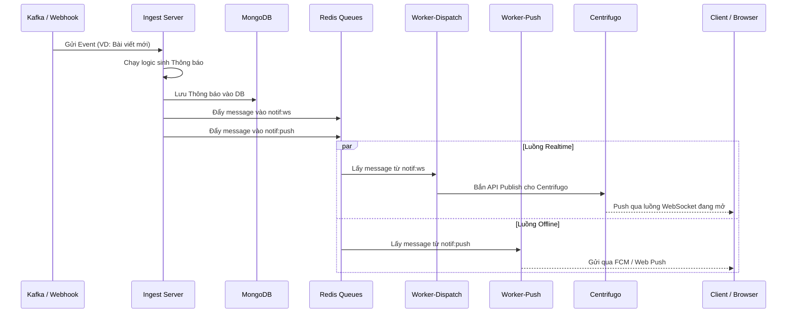

# Kiến Trúc Các Server (be-modami-noti-service)

Dự án `be-modami-noti-service` là một hệ thống phân tán, hướng sự kiện (event-driven) bao gồm 5 ứng dụng (binary) độc lập chạy trong thư mục `cmd/`. Dưới đây là chi tiết cụ thể về kiến trúc và luồng hoạt động (flow) của từng server.

---

## 1. API Server (`cmd/api`)
**Cổng hoạt động:** `:7070`
**Giao thức:** `HTTP REST`

### Chức năng chính:
Đây là REST API server dành riêng cho Client (Frontend Web, Mobile App). Chịu trách nhiệm cung cấp các tác vụ đọc dữ liệu và quản lý thiết lập của người dùng. Server này phi trạng thái (stateless) và chỉ kết nối trực tiếp đến cơ sở dữ liệu MongoDB.

### Các luồng xử lý (Flows):
* **Quản lý thông báo:** Cung cấp API `GET /notifications` để lấy danh sách thông báo, `PATCH /notifications/{id}/read` để đánh dấu đã đọc.
* **Xác thực WebSocket:** Cung cấp API `POST /auth/centrifugo-token` để sinh và trả về JWT Token. Client sẽ dùng token này để kết nối bảo mật tới Centrifugo.
* **Đăng ký nhận Push:** Cung cấp API `POST /subscribers` để nhận Device Token (ví dụ: FCM token của iOS/Android) từ thiết bị nhằm phục vụ cho push notification khi người dùng offline.
* **Thiết lập:** `GET/PUT /preferences` để bật/tắt nhận thông báo (VD: tắt In-App, tắt Push).

---

## 2. Ingest Server (`cmd/ingest`)
**Cổng hoạt động:** `:7071`
**Giao thức:** `TCP (Kafka)` & `HTTP (Webhook)`

### Chức năng chính:
Đóng vai trò là "Cửa ngõ tiếp nhận sự kiện" (Event Ingestion). Nhiệm vụ của nó là lắng nghe các sự kiện (ví dụ: có người bình luận, có bài viết mới) từ các hệ thống khác, sau đó chuyển đổi chúng thành thông báo và phân phối vào các hàng đợi (queues).

### Các luồng xử lý (Flows):
* **Nguồn 1 (Kafka Consumer):** Lắng nghe liên tục từ các topic của Kafka (vd: `modami.content.published`). Khi có message, Ingest sẽ mapping sự kiện thông qua `Handler Registry` (ví dụ: event `comment_created` sẽ gọi hàm `CommentCreated`).
* **Nguồn 2 (HTTP Webhook):** Cung cấp API `POST /webhook` để nhận event trực tiếp thông qua HTTP Request (dùng khi không có Kafka hoặc để test).

### Quy trình xử lý bên trong Ingest (NotificationService.Process):
1. **Persist (Lưu trữ):** Tạo bản ghi thông báo và lưu vào `MongoDB` (collection: notifications).
2. **Filter (Lọc):** Kiểm tra xem người dùng có tắt thông báo không (đọc từ `MongoDB` collection: preferences).
3. **Enrich (Làm giàu dữ liệu):** Đối với Push Notification, truy vấn `MongoDB` để lấy Device Token của người dùng.
4. **Enqueue (Đẩy vào hàng đợi):** 
   - Đẩy message vào Redis Queue `notif:ws` (cho In-App WebSocket).
   - Đẩy message vào Redis Queue `notif:push` (cho Push notification).

---

## 3. WS-Gateway (`cmd/ws-gateway`)
**Cổng hoạt động:** `:7072`
**Giao thức:** `HTTP` (Chỉ Centrifugo gọi nội bộ)

### Chức năng chính:
Đóng vai trò là một Proxy bảo mật và kiểm soát truy cập cho máy chủ WebSocket **Centrifugo**. Thay vì tự quản lý WebSocket connection (rất tốn tài nguyên), dự án uỷ quyền cho Centrifugo quản lý kết nối, và Centrifugo sẽ gọi ngược lại (callback) WS-Gateway để hỏi quyền.

### Các luồng xử lý (Flows):
* **Connect (`POST /connect`):** Khi client mang JWT Token đến Centrifugo để kết nối, Centrifugo gọi API này của WS-Gateway. WS-Gateway giải mã Token, trích xuất `userID` và trả về lệnh tự động Subscribe user vào channel cá nhân (`noti:user:{id}`).
* **Subscribe (`POST /subscribe`):** Kiểm tra quyền xem user có được phép lắng nghe channel cụ thể hay không.
* **Publish (`POST /publish`):** Áp dụng thuật toán Token Bucket để giới hạn tần suất (Rate limit) số lượng message client được phép gửi.

---

## 4. Worker Dispatch (`cmd/worker-dispatch`)
**Cổng hoạt động:** `:7073` (Chỉ dùng cho Healthcheck)
**Giao thức kết nối chính:** `Redis (BRPOP)` & `HTTP`

### Chức năng chính:
Đây là worker xử lý việc gửi thông báo theo thời gian thực (Real-time Fanout). 

### Các luồng xử lý (Flows):
1. Worker liên tục chặn và chờ (blocking read `BRPOP`) trên hàng đợi Redis `notif:ws`.
2. Khi Ingest server đẩy một sự kiện vào `notif:ws`, Worker Dispatch lập tức lấy ra.
3. Giải mã message để lấy thông tin channel (ví dụ: gửi cho `user:abc123`).
4. Bắn một HTTP Request (`POST /api/publish`) sang máy chủ **Centrifugo** với nội dung thông báo.
5. Centrifugo sau đó tự động đẩy message này xuống tất cả các client đang mở kết nối WebSocket theo thời gian thực.

---

## 5. Worker Push (`cmd/worker-push`)
**Cổng hoạt động:** `:7074` (Chỉ dùng cho Healthcheck)
**Giao thức kết nối chính:** `Redis (BRPOP)`

### Chức năng chính:
Đây là worker chuyên trách xử lý các tác vụ Push Notification tốn thời gian (gọi qua API của Google/Apple), đảm bảo người dùng offline vẫn nhận được thông báo rung điện thoại hoặc hiển thị trên máy tính.

### Các luồng xử lý (Flows):
1. Worker chặn và chờ (`BRPOP`) trên hàng đợi Redis `notif:push`.
2. Khi có sự kiện từ hàng đợi, Worker lấy ra danh sách các Device Tokens và nội dung thông báo (Title, Body, Link).
3. Đóng gói payload và giao tiếp thông qua Firebase Cloud Messaging (FCM) hoặc cơ chế Web Push (VAPID) để gửi đi. (Hiện tại logic này đang ở dạng stub/log, chuẩn bị tích hợp).

---

## Tóm tắt kiến trúc tổng thể bằng Sơ đồ

