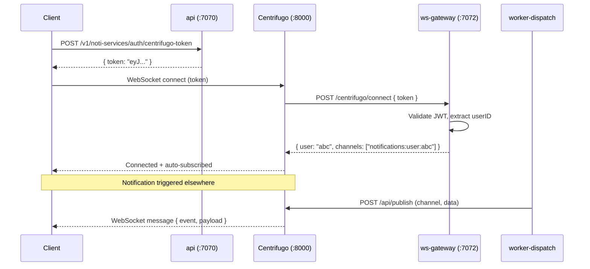

# WebSocket & Centrifugo

How clients establish real-time connections, how authentication works, and how notifications are delivered over WebSocket.

## Overview

Centrifugo is a standalone WebSocket/SSE server. This service does **not** handle WebSocket connections directly. Instead:

- Clients connect directly to Centrifugo (`:8000`)
- Centrifugo proxies auth decisions to `ws-gateway` (`:7072`)
- `worker-dispatch` publishes messages to Centrifugo via HTTP API

```
Client ──WebSocket──▶ Centrifugo (:8000)
                           │  proxy callbacks
                           ▼
                     ws-gateway (:7072)
                     POST /centrifugo/connect
                     POST /centrifugo/subscribe
                     POST /centrifugo/publish

worker-dispatch ──HTTP──▶ Centrifugo POST /api/publish
```

## Full Connection Flow

### Step 1 — Client requests a connection token

```
Client  ──POST /v1/noti-services/auth/centrifugo-token──▶  api (:7070)
        { "user_id": "abc123" }

api  ──▶  GenerateConnectionToken(hmacSecret, userID, ttl)
          HS256 JWT: { sub: "abc123", iat: ..., exp: iat+3600 }

api  ──▶  Client: { "data": { "token": "<jwt>" } }
```

The JWT is signed with `centrifugo.hmac_secret` (configured in `config/config.yaml`). Centrifugo is configured with the same secret under `token_hmac_secret_key`.

### Step 2 — Client connects to Centrifugo

The client passes the JWT in the connection request. Centrifugo validates the token signature itself, then proxies the connect request to `ws-gateway`:

```
Client  ──WebSocket connect──▶  Centrifugo
                                     │
                  POST /centrifugo/connect
                  {
                    "client": "client-id",
                    "token":  "<jwt>",
                    "data":   {}
                  }
                                     │
                                     ▼
                               ws-gateway
```

**ws-gateway connect handler** (`internal/gateway/handler.go`):

1. Parses the JWT from `ProxyConnectRequest.Token`
2. Validates signature with HMAC secret
3. Extracts `sub` (user ID) from claims
4. Returns `ProxyConnectResult`:
   ```json
   {
     "result": {
       "user": "abc123",
       "channels": ["notifications:user:abc123"]
     }
   }
   ```

The `channels` array auto-subscribes the user to their personal notification channel on connect.

### Step 3 — Centrifugo proxies subscribe request

If the client explicitly subscribes to a channel (or the auto-subscription from step 2 triggers):

```
Centrifugo  ──POST /centrifugo/subscribe──▶  ws-gateway
{
  "client":  "client-id",
  "user":    "abc123",
  "channel": "notifications:user:abc123"
}
```

**ws-gateway subscribe handler**:

| Channel pattern | Policy |
|----------------|--------|
| `notifications:user:{id}` | Allow only if `user == id` |
| `notifications:topic:*` | Allow all (public topic channels) |
| anything else | Deny (403) |

```json
// Allowed
{ "result": {} }

// Denied
{ "error": { "code": 403, "message": "forbidden" } }
```

### Step 4 — Notification delivered via WebSocket

When a notification is triggered:

```
worker-dispatch  ──POST /api/publish──▶  Centrifugo
{
  "channel": "notifications:user:abc123",
  "data": {
    "event":   "content_published",
    "payload": {
      "notification_id": "notif-xyz",
      "title": "New post from Alice",
      "body":  "Check out this article",
      "link":  "/posts/post-1"
    }
  }
}

Centrifugo  ──WebSocket push──▶  Client (abc123)
```

The client receives the raw `data` object over the WebSocket connection.

## Channel Naming

```go
// pkg/centrifugo/channels.go
func ChannelFromRoomID(roomID string) string {
    return "notifications:" + roomID
}
```

| Room ID | Centrifugo Channel |
|---------|-------------------|
| `user:abc123` | `notifications:user:abc123` |
| `topic:global` | `notifications:topic:global` |

Each user's personal channel is `notifications:user:{userID}`. This is the channel that receives all in-app notifications for that user.

## Token Structure

### Connection Token

```json
{
  "sub": "abc123",
  "iat": 1712600000,
  "exp": 1712603600
}
```

Signed with `HS256`. TTL is configurable via `centrifugo.token_ttl` (default: 3600 seconds).

### Subscription Token (optional)

For private channel subscriptions, a subscription token can be generated separately:

```go
// pkg/centrifugo/token.go
GenerateSubscriptionToken(secret, userID, channel, ttl)
// JWT adds: { "channel": "notifications:user:abc123" }
```

Currently, subscriptions are authorized via the proxy callback instead of subscription tokens.

## Publish Rate Limiting

When a **client** attempts to publish to a channel (client-side publish), `ws-gateway` enforces a per-user token bucket:

```go
// internal/gateway/ratelimit.go
Rate:  10 events/second
Burst: 20 events
```

If exceeded:
```json
{ "error": { "code": 429, "message": "rate limit exceeded" } }
```

Server-side publishes (from `worker-dispatch`) are not rate-limited.

## Centrifugo Configuration

### Key settings (`deploy/centrifugo/config.json`)

```json
{
  "token_hmac_secret_key": "<same as centrifugo.hmac_secret>",
  "api_key":               "<same as centrifugo.api_key>",
  "proxy_connect_endpoint":   "http://ws-gateway:7072/centrifugo/connect",
  "proxy_subscribe_endpoint": "http://ws-gateway:7072/centrifugo/subscribe",
  "proxy_publish_endpoint":   "http://ws-gateway:7072/centrifugo/publish",
  "proxy_connect_timeout":    "5s",
  "proxy_subscribe_timeout":  "3s",
  "proxy_publish_timeout":    "3s",
  "namespaces": [{
    "name": "notifications",
    "presence": true,
    "history_size": 100,
    "history_ttl": "300s",
    "recover": true
  }]
}
```

### Environment variables (production)

| Variable | Description |
|----------|-------------|
| `CENTRIFUGO_TOKEN_HMAC_SECRET_KEY` | JWT signing secret (must match service config) |
| `CENTRIFUGO_API_KEY` | Server-side API key for publishing |
| `CENTRIFUGO_ADMIN_PASSWORD` | Admin UI password |
| `CENTRIFUGO_ADMIN_SECRET` | Admin API secret |
| `CENTRIFUGO_ALLOWED_ORIGINS` | Comma-separated allowed WebSocket origins |

## Client Integration (JavaScript)

```javascript
import { Centrifuge } from 'centrifuge';

// 1. Get connection token from API
const { data: { token } } = await api.post('/v1/noti-services/auth/centrifugo-token', {
  user_id: currentUser.id
});

// 2. Connect to Centrifugo
const centrifuge = new Centrifuge('ws://localhost:8000/connection/websocket', { token });

// 3. Subscribe to personal notification channel
const sub = centrifuge.newSubscription(`notifications:user:${currentUser.id}`);

sub.on('publication', (ctx) => {
  const { event, payload } = ctx.data;
  console.log('Notification received:', event, payload);
  // Update UI: show toast, update notification bell count, etc.
});

sub.subscribe();
centrifuge.connect();
```

## Sequence Diagram — Full WebSocket Auth Flow



## Proxy Error Codes

| Code | Meaning |
|------|---------|
| 401 | Unauthorized — invalid or missing token |
| 403 | Forbidden — channel access denied |
| 429 | Rate limit exceeded |
| 500 | Internal error in proxy handler |
